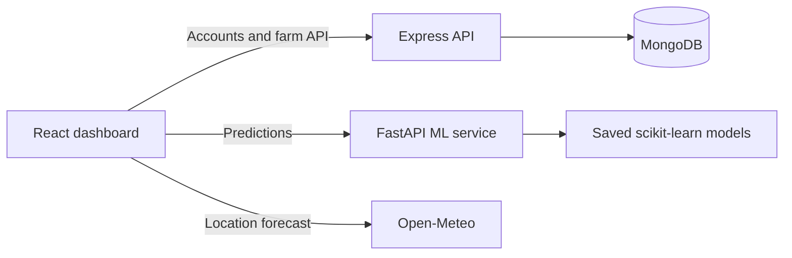

# KhetWise


**Smart agriculture tools for more informed farm decisions.**

KhetWise is a full-stack agriculture platform with crop and input recommendations, local weather, farm management and a guided farmer assistant. It combines a React dashboard, an Express and MongoDB account API, and a FastAPI service for machine-learning predictions.

> **Project status:** KhetWise is an evolving project. Model results are estimates and should be checked against field observations and local agricultural guidance.

## Features

- **Crop recommendation** using soil nitrogen, phosphorus, potassium, pH and growing-condition inputs.
- **Fertilizer recommendation** based on crop and soil data.
- **Yield per area calculation** from production and cultivated area.
- **Market price estimate** using a commodity and current market price range. This estimates a modal price; it is not a future-price forecast.
- **Plant symptom screening** for early guidance. The current classifier is a prototype trained on synthetic data and is not a plant-disease diagnosis.
- **Crop growth screening** using crop, soil and field-condition inputs. Its categories are dataset labels, not validated agronomic grades.
- **Farm weather** with current conditions and a seven-day forecast for the saved farm location, provided by [Open-Meteo](https://open-meteo.com/).
- **Regional soil guide** with broad soil and crop information. Farm-level soil tests are needed for field-specific decisions.
- **Farm Assistant** with guided English and Hindi responses for common questions about pests, symptoms, irrigation, fertilizer, weather, crop choice and prices. Voice input uses browser speech recognition where available.
- **Account access** with registration, login and protected dashboard services.

## How it is built



| Part | Technology | Local address |
|---|---|---|
| Web client | React, Vite, Tailwind CSS | `http://localhost:5173` |
| Account and farm API | Node.js, Express, MongoDB | `http://localhost:8080` |
| Prediction API | Python, FastAPI, scikit-learn | `http://localhost:8000` |

## Requirements

- Git
- Node.js 20.19+ or 22.12+ and npm
- Python 3.11 or later
- A MongoDB database, local or hosted (for example, MongoDB Atlas)

## Run locally on Windows

Run each service in its **own PowerShell terminal** from the repository directory `D:\KhetWise`.

### 1. Start the ML service

```powershell
cd D:\KhetWise\ml-service
python -m venv venv
.\venv\Scripts\python.exe -m pip install --upgrade pip
.\venv\Scripts\python.exe -m pip install -r requirements.txt
.\venv\Scripts\python.exe -m uvicorn main:app --reload --port 8000
```

The interactive API documentation is available at [http://localhost:8000/docs](http://localhost:8000/docs). The saved model files used by the API are in `ml-service/models/`.

### 2. Configure and start the Express API

```powershell
cd D:\KhetWise\server
npm install
Copy-Item .env.example .env
notepad .env
npm run dev
```

Set your MongoDB connection string and a private JWT secret in `server/.env`:

```dotenv
PORT=8080
MONGO_URL=mongodb://127.0.0.1:27017/khetwise
JWT_SECRET=replace-with-a-long-random-secret
```

For MongoDB Atlas, use your own connection string for `MONGO_URL`. Keep `.env` private; it is excluded from Git.

### 3. Start the web client

```powershell
cd D:\KhetWise\client
npm install
npm run dev
```

Open the local Vite address printed in the terminal, usually [http://localhost:5173](http://localhost:5173). The auth API defaults to `http://localhost:8080`; set `VITE_AUTH_API_URL` in `client/.env.local` if your Express API uses another address. The ML API currently uses `http://127.0.0.1:8000` in `client/src/services/mlApi.js`.

## API routes

### Express API

- `POST /api/users` — register a farmer
- `POST /api/users/login` — log in
- `GET /` — API status
- Farm, soil, weather, crop, market-price, alert and recommendation routes are mounted under `/api/` in `server/app.js`.

### FastAPI prediction API

- `GET /health` — health check
- `GET /model-features` — features expected by the models
- `POST /predict/crop` — crop recommendation
- `POST /predict/fertilizer` — fertilizer recommendation
- `POST /predict/yield` — yield per area calculation
- `POST /predict/price` — market price estimate
- `POST /predict/disease` — plant symptom screening
- `POST /predict/growth` — crop growth category

## Project structure

```text
KhetWise/
├── client/                 # React and Vite web application
├── server/                 # Express API, authentication and MongoDB models
├── ml-service/             # FastAPI application, model files and training data
│   ├── Data/
│   ├── Training/
│   └── models/
├── package.json
└── README.md
```

## Build the web client

```powershell
cd D:\KhetWise\client
npm run build
```

The generated production files are written to `client/dist/` and are excluded from Git.

## Troubleshooting

- **`uvicorn` is not recognized:** Use the virtual-environment Python command shown above: `.\venv\Scripts\python.exe -m uvicorn main:app --reload --port 8000`.
- **MongoDB connection failed:** Check that MongoDB is running and that `MONGO_URL` in `server/.env` is valid.
- **Login or registration cannot connect:** Confirm the Express API is running on port `8080` and check `VITE_AUTH_API_URL` if you changed the port.
- **A prediction cannot connect:** Confirm the ML service is running on port `8000` and that the model files listed in `ml-service/main.py` exist.
- **The microphone button is unavailable:** Speech recognition support varies by browser and requires microphone permission. Typed questions remain available.
- **Forecast lookup fails:** Check the saved farm location and internet connection. Weather lookup uses Open-Meteo and does not need an API key.

## Notes on recommendations

KhetWise is a decision-support project, not a replacement for a local agronomist, soil laboratory or crop-protection specialist. Use soil-test results for nutrient decisions. The Farm Assistant provides guided first steps and does not diagnose crop disease or prescribe pesticide products or doses. For severe or spreading field problems, contact your district agriculture office or [local Krishi Vigyan Kendra](https://www.icar.gov.in/en/krishi-vigyan-kendras-kvks).
